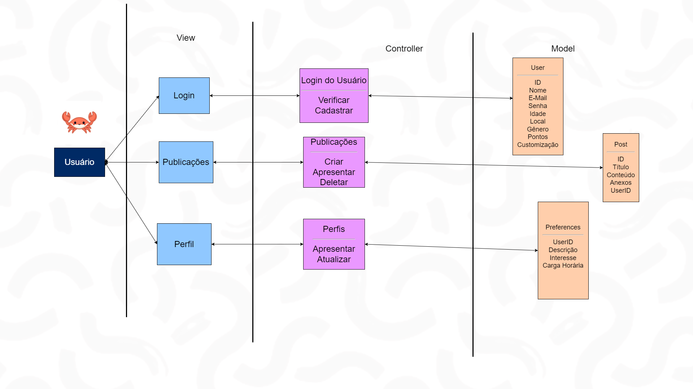

# Atividade ponderada 2 de Computação

Estudante: Nataly de Souza Cunha | T11 | G01

Professor: <a href="https://www.linkedin.com/in/cristiano-benites-687647a8/">Prof. Me. Cristiano Benites</a> 

## 🎯 Objetivos da atividade

&nbsp;&nbsp;&nbsp;&nbsp;Através da resolução da atividade, espera-se o maior entendimento teórico e prático de arquiteturas e estruturas de dados, bem como a compreensão do padrão *Model-View-Controller* (MVC).

## 💻 Arquitetura de dados - Padrão MVC

&nbsp;&nbsp;&nbsp;&nbsp;*Model-View-Controller* se trata de um modelo arquitetural que orienta a construção de *softwares* orientados a objetos. Neste padrão, a lógica de negócios, a interface do usuário e a manipulação de dados são separados em componentes distintos, de forma a aprimorar a eficiência do desenvolvimento evolucionário da aplicação, a modularização dos processos de produção, reforçar a segurança através da descentralização das funções de um programa, entre outros benefícios (DEACON, 2009; VALENTE, 2020). 
&nbsp;&nbsp;&nbsp;&nbsp;Nesse contexto, a *Model* (Modelo) se trata de uma entidade representativa de objetos, armazenando os dados e a lógica de negócios da aplicação, interagindo com o banco de dados e gerenciando o estado da informação. A *View* (Visualização) é responsável pela apresentação da interface com o usuário, exibindo os dados do modelo. Os *Controllers* (Controladores) atuam como intermediários entre o modelo e a visualização, controlando as interações do usuário e atualizando o modelo conforme necessário (DEACON, 2009; VALENTE, 2020). 
&nbsp;&nbsp;&nbsp;&nbsp;Nesta atividade, houve a construção de uma representação do planejamento arquitetural da plataforma *Oportoniza*, uma plataforma *web* criada para a Parceiros Voluntários com o *framework Sails*, de forma a fomentar a centralização e conexão de diferentes organizações, causas sociais e voluntários em um só lugar, com o objetivo de fomentar a cultura de transformação social no Brasil. 

Fonte: Tripulação Voluntária (2024)

&nbsp;&nbsp;&nbsp;&nbsp;De acordo com a representação acima, na plataforma *Oportoniza* planeja-se que o usuário possa fazer *login* ou se cadastrar, editar seu perfil, além de publicar suas próprias organizações e causas sociais. Além disso, ao logar na plataforma, pode-se acumular pontos para conseguir customizar o mascote da plataforma;
- No lado esquerdo, tem-se o usuário como quem irá interagir com a aplicação *web* e suas funcionalidades;
- Em *View*, estão representadas três páginas diferentes: *login*, criação de publicações e preenchimento de perfil do usuário;
- Em *Controller*, há as funcionalidades relacionadas ao login e cadastro do usuário, às publicações do usuário;
- Acessando a *view* de *login*, existem duas funcionalidades associadas em *Controllers*, a de verificação de usuário na tentativa de *login* e, caso ele não seja inscrito, a de cadastro dele. Estas duas funções se relacionam com a *Model User* (Usuário), que possui espaços de armazenamento no banco de dados para os dados de ID, nome, *e-mail*, senha, idade, localização, gênero, pontos, e customização;
- Acessando a *view* de Publicações, existem três funcionalidades associadas em *Controllers*, a de criar postagens, apresentar e deletar. Esta três funções se relacionam com a Model *Post* (Postagem), que possui espaços de armazenamento no banco de dados para os dados de ID da postagem, título, conteúdo, anexos e a referenciação do ID do usuário que realizou a publicação;
- Acessando a *view* de Perfis, existem duas funcionalidades associadas em *Controllers*, a de apresentar o perfil e atualizá-lo. Esta duas funções se relacionam com a *Model Preferences* (Preferências), que possui espaços de armazenamento no banco de dados para a referenciação do ID do usuário de acesso, descrição, interesses e disponibilidade de carga horária. 

&nbsp;&nbsp;&nbsp;&nbsp;O diagrama foi elaborado com um *design* correspondente às decisões de identidade visual definidas pela equipe, as quais são adaptadas do Guia de Estilos da Parceiros Voluntários. O estilo simples do modelo, com uma quantidade reduzida de elementos dispostos de forma organizada, garante a compreensão simplificada do seu escopo. Além disso, a inclusão de cores, elementos e texturas idealizados pela equipe garantem maior dinamismo e intuitividade durante a contemplação. 
&nbsp;&nbsp;&nbsp;&nbsp;Por fim, ao analisar as idealizações da plataforma feitas com base nos objetivos da solução desenvolvida para a Parceiros Voluntários, compreende-se que o modelo MVC produzido atende os objetivos e requisitos do projeto, pois as *Models* possuem atributos suficientes e coerentes para serem utilizados pelas funcionalidades dos *Controllers* que, justamente, representam atividades correspondentes aos diferentes casos de uso do usuário a partir das páginas (*Views*) disponibilidadas.

## Referências

DEACON, John. Model-view-controller (mvc) architecture. Online [Citado em: 10 de março de 2006.] http://www.jdl.co.uk/briefings/MVC.pdf, v. 28, p. 61, 2009.

VALENTE, Marco Tulio. Engenharia de *software* moderna. Princípios e Práticas para Desenvolvimento de Software com Produtividade, v. 1, p. 24, 2020.